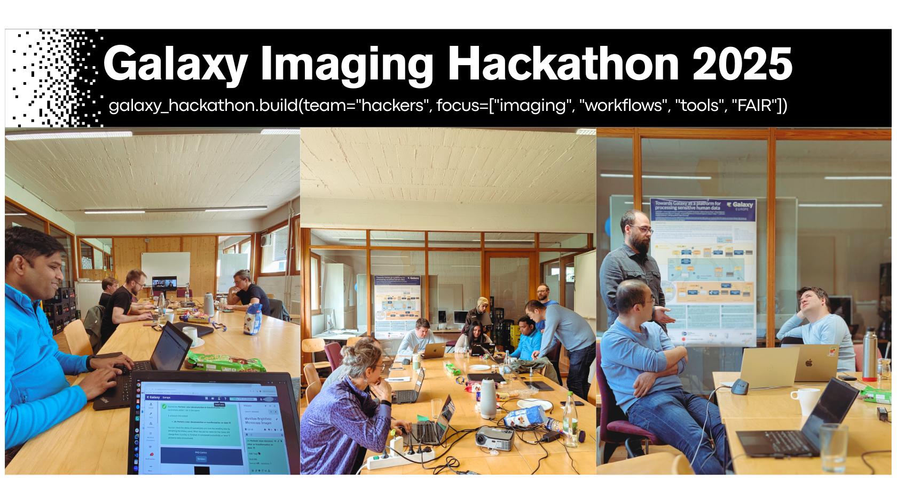

# 🧬 Lights, Camera... Hacking! Highlights from the Galaxy Imaging Hackathon 2025 🎬🔬

## April 22nd-24th, 2025 | Freiburg, Germany 🌱
In April 2025, members of the Galaxy community came together for an energizing three-day hackathon focused on advancing FAIR image analysis and workflows in Galaxy. Whether participating virtually or in-person, and fueled by plenty of coffee and sweets, we rolled up our sleeves, exchanged ideas, solved bugs, built tools, and ended each day with great conversations over dinner in Freiburg. 🍽️

This wasn’t just about closing issues. It was about shared problem solving and community-driven development. Across those three days, contributors dove into discussions, whiteboarded bold ideas, and tackled technical challenges side by side. By the end, we had made meaningful progress toward expanding Galaxy’s capabilities for image analysis!

## Key Milestones
A new [Galaxy workflow for Brightfield Microscopy](https://github.com/FAIR-imaging/galaxy-image-community/issues/35), tailored to Masson Trichrome and IHC images, was successfully completed. The [Bellavista visualiser](https://github.com/FAIR-imaging/galaxy-image-community/issues/45) was integrated into Galaxy, bringing spatial transcriptomics data to life. We also released a new [tutorial on parameter tuning and image segmentation evaluation](https://github.com/FAIR-imaging/galaxy-image-community/issues/38), helping users benchmark and optimize segmentation results.

Meanwhile, our tools were tested across diverse file types in a [format compatibility investigation](https://github.com/FAIR-imaging/galaxy-image-community/issues/34), and improvements were made to enhance the user experience, such as restoring the [GitHub link on imaging.usegalaxy.eu](https://github.com/FAIR-imaging/galaxy-image-community/issues/29) and [standardizing `.TIFF` vs `.TIF` extensions](https://github.com/FAIR-imaging/galaxy-image-community/issues/43) across tools.

We also dedicated time to expanding and promoting training materials. A feature article was published to showcase the [BMZ microscopy tutorial](https://galaxyproject.org/news/2025-04-23-bmz-galaxy/), and we began drafting a [general “Where to Start” tutorial for image analysis](https://github.com/FAIR-imaging/galaxy-image-community/issues/36) to support new users in navigating Galaxy’s imaging tools. One tutorial was even finalized during the hackathon: [Parameter tuning for image analysis](https://training.galaxyproject.org/training-material/topics/imaging/tutorials/parameter-tuning/tutorial.html), which helps users evaluate and optimize segmentation results.

## Exciting Work Underway
Development began on integrating [OMERO as a file source](https://github.com/FAIR-imaging/galaxy-image-community/issues/17), as well as [porting Fractal tasks and workflows](https://github.com/FAIR-imaging/galaxy-image-community/issues/31) into the Galaxy ecosystem. We explored extending support for AI inference tools with [TensorFlow compatibility](https://github.com/FAIR-imaging/galaxy-image-community/issues/37), started building a [VPT preprocessing tool for MEROSCOPE images](https://github.com/FAIR-imaging/galaxy-image-community/issues/41), and developed plans for a new tool focused on [gel band quantification using ImageJ](https://github.com/FAIR-imaging/galaxy-image-community/issues/42).

## Final Thoughts
Throughout it all, tool integration, workflow refinement, and in-depth investigation defined the rhythm of the hackathon. We tested pipelines, cleaned up quirks, and kept usability and accessibility front and center.

What excites us most isn't just the code we wrote; it's the momentum of a growing, inclusive community. The Galaxy imaging community is expanding, and together we're building a welcoming, collaborative space to support image analysis in a FAIR, scalable, and user-friendly way.

Thanks to everyone who joined, brainstormed, debugged, contributed, and co-created. We can't wait for the next round and set again Github on Fire!

## 📣 Stay Connected

Join the conversation in our Matrix channel: [#galaxyproject_imaging:matrix.org](https://matrix.to/#/#galaxyproject_imaging:matrix.org)

Explore more Galaxy imaging resources:  
🔗 [Galaxy Image Analysis Community](https://galaxyproject.org/community/sig/image-analysis/)  
🔗 [Imaging Flavour of Galaxy](https://imaging.usegalaxy.eu)

### Supporters

  
  
  

