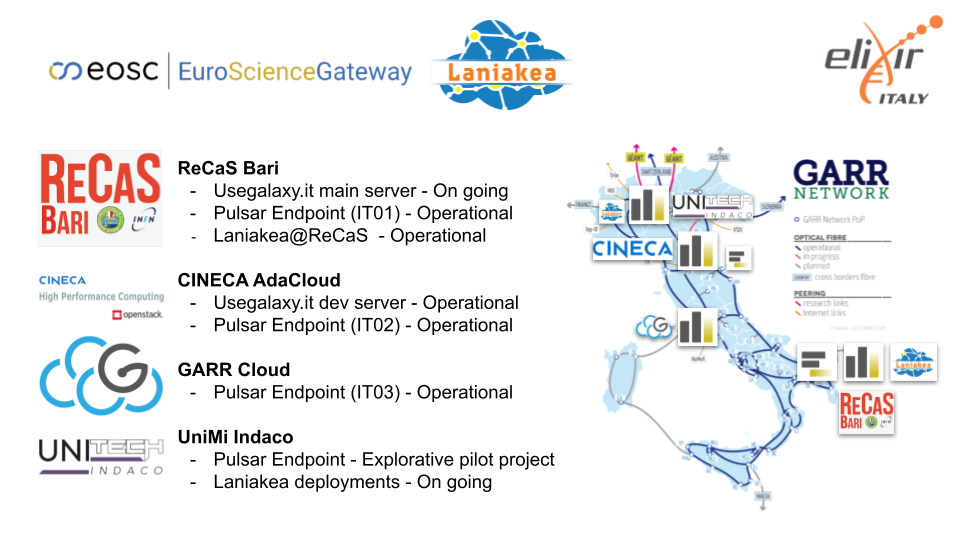

The Italian National Galaxy Server, UseGalaxy.it, is under development as part of the EOSC [**EuroScienceGateway**](/projects/esg/) (ESG)
project's Work Package 3, which foresees 6 national Galaxy instances as a crucial component for providing scalable, highly available distributed
computational infrastructure across Europe.

To further engage resource providers and extend the computational network, ESG is developing the Open Infrastructure,
delivering all the instruments needed for deploying and managing Galaxy and Pulsar instances over partner's Cloud infrastructures.

UseGalaxy.it, utilizing Open Infrastructure, stands as a cloud-hosted platform and its test instance is currently
hosted at the [CINECA ADA Cloud](https://adacloud.hpc.cineca.it), which provides the resources necessary for its development, ensuring a robust and scalable infrastructure capable of meeting the demands of scientific research. 

The virtual infrastructure consists of a set of virtual machines, each of which with different resources allocated (CPU, RAM, storage) and network settings, hosting a specific microservice, for serving Galaxy.

<figcaption>
  UseGalaxy.it architecture concept.
</figcaption>

 
 

The Figure shows the architecture of UseGalaxy.it. All the VMs are created using Terraform and configured using Ansible. The PostgreSQL database cluster includes the PostgreSQL database server, a backup machine, and a replica server: PostgreSQL constantly synchronises with the replica server and periodically sends backups to the Backup machine according to the schedule. UseGalaxy.it leverages the power of the HTCondor pool to orchestrate job scheduling, creating a high-throughput computational environment. This means that users can perform data analysis and computation tasks more effectively, accelerating the pace of scientific discovery. The HTCondor cluster is fully managed through Jenkins and GitHub. The UseGalaxy infrastructure, in terms of number and types of compute nodes, is described through a YAML file available on [GitHub](https://github.com/usegalaxy-it/vgcn-infrastructure). This file is continuously checked by a Jenkins pipeline that, in case of changes, interacts with OpenStack creating or deleting compute nodes. Thanks to this implementation it is possible to obtain an elastic infrastructure that can be modulated with respect to the workload of the Galaxy instance. Furthermore, to streamline management processes we've automated key administrative processes within UseGalaxy.it, integrated into CI/CD Jenkins pipelines. Tasks such as tools installation, updates, VGCN management, and Galaxy server/client updates have become more straightforward to provide users with the latest features in a quick and automated way. Finally, the CernVM FileSystem is used for sharing reference genomes, genome indices, bioinformatic tool indices, and tool containers.

To further extend the resources available to the server, and to profit from the multiple technological partners of ELIXIR Italy, able to host Pulsar endpoints, we have deployed endpoints, to be connected to the Pulsar Network at [GARR Cloud](https://cloud.garr.it/), [CINECA ADA Cloud](https://adacloud.hpc.cineca.it) (Cineca), [INDACO](https://www.indaco.unimi.it/), and the [ReCaS Bari datacenter](https://www.recas-bari.it/).

The deployment procedures and all the configurations are reported in the documentation available [here](https://usegalaxy-it.github.io/documentation/).

#### Future outlook
This work serves as the foundation for the forthcoming ELIXIR-IT infrastructure, which will host UseGalaxy.it. Dedicated storage resources have been acquired in the context of the ELIXIRxNextGenIT RRF project, while compute resources will be provided by the ReCaS Bari data center in the scope of the CNR.BiOmics PON project, making UseGalaxy.it able to satisfy multiple simultaneous access and jobs. Our service ecosystem will be comleted with the possibility to deploy on-demand Galaxy instance through [Laniakea](https://laniakea-elixir-it.github.io/).

<figcaption>
  UseGalaxy.it technological partners overview.
</figcaption>

 
 

#### Acknowledgments
We thank ELIXIR-Italy, ReCaS-Bari, GARR and Cineca for providing the computing facilities. 

#### WP3 Repositories
* [Usegalaxy-it GitHub](https://github.com/usegalaxy-it/)
* [Usegalaxy-it documentation](https://usegalaxy-it.github.io/documentation/)
