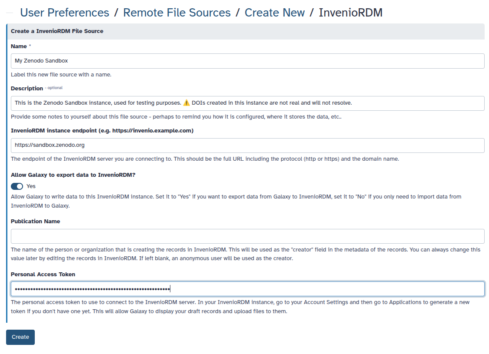

Some time back, [in this post](../2024-05-03-inveniordm-integration/), we introduced an integration that aimed to enhance **research data management in Galaxy** by connecting it with InvenioRDM-compatible repositories like [Zenodo](https://zenodo.org). This integration allowed users to export research results directly from Galaxy to their institution's InvenioRDM repository or Zenodo and import files from these repositories into Galaxy for further analysis.

We’ve recently introduced some general improvements to give users more control over managing their data repositories in Galaxy, along with enhancements in the user interface in the upcoming Galaxy 25.0 release. With this update, managing external data sources is now more user-friendly and customizable, ensuring a smoother experience when importing and exporting research data.

We've also addressed some of the limitations of the previous integration, such as the limited number of records that could be listed, the lack of support for pagination, and the inability to use the `Export datasets` tool with InvenioRDM repositories.

## What's New?

Previously, depending on the server, Galaxy could present a long list of integration options when users tried to import or export data, which could be overwhelming, especially for users who only use a few of them. Also, when an integration required credentials, users had to find the right place to enter them under the `User Preferences -> Manage Information` section along with a potentially long list of other settings.
Now, you can **create, manage and configure your remote data integrations** from a dedicated section in your **User Preferences**. This improvement allows you to tailor your integrations to only those relevant to your use case, making the interface cleaner and more focused on your needs.

### How to integrate InvenioRDM repositories

The new **Manage Your Remote File Sources** section is available under **User → Preferences**. We will integrate the [_Zenodo Sandbox_](https://sandbox.zenodo.org/) instance for demonstration purposes, but you can also configure your institution's InvenioRDM instance. Here’s how it works:

1. Navigate to **User → Preferences → Manage Your Remote File Sources**. If you haven't set up any integrations yet, you'll see an empty list.
   
2. Click **+ Create** to configure a new integration. You'll see a list of available integrations, including **S3, Dropbox, InvenioRDM, Zenodo**, and more (depending on your Galaxy server).
   
3. Select **InvenioRDM** to configure it and enter your **credentials or relevant connection details**.
   
4. Once set up, your InvenioRDM integration, in this case, _My Zenodo Sandbox_, will appear in the list where you can manage or delete it.
   
5. Similar to what we described in the [previous post in the sections about importing and exporting](../2024-05-03-inveniordm-integration/#importing-records-and-files-into-galaxy) your selected integrations will appear first when browsing import/export locations. Note that for some time, the old integrations will still be available, but we recommend using the new interface for a better experience as we will eventually phase out the old integrations.
   

**Note:** If you want to integrate the "real" Zenodo instance, we recommend using the Zenodo integration instead of InvenioRDM. This will improve the integration further by making it more prominent in some parts of the Galaxy interface.

### Why This Change?

This new approach comes with several advantages:

-   **Decluttered Interface**: More focused list of integration, instead of an overwhelming list of all possible sources that may or may not be relevant to you. Galaxy instances will still provide publicly available integrations globally, but those requiring credentials will be managed by you. The old integrations will still be available for some time, but gradually phased out and removed from the interface.
-   **Customization**: You can tailor your integrations to your needs, giving your own names and descriptions to easily identify.
-   **Faster Access**: Your configured integrations are prioritized when importing/exporting, making them easier to find.
-   **Easier Management**: You can update or remove integrations anytime from **User Preferences** reducing the need to search for the right place to enter credentials.

## Getting Started

If you haven’t yet explored this feature, try setting up a Zenodo or InvenioRDM integration or any other available integration on your Galaxy server today! Here’s a quick guide to get you started:

1. **Create a Personal Access Token (PAT)**: If required, generate a PAT in [Zenodo Sandbox](https://sandbox.zenodo.org/) under `User Settings → Applications`.
2. **Configure in Galaxy**: Add the integration under `Manage Your Remote File Sources`.
3. **Import & Export with Ease**: Browse and use your configured integrations within Galaxy.

## Conclusion

With these improvements, Galaxy users now have more flexibility in managing their external data connections, reducing clutter and improving focus when importing and exporting research data. By allowing users to configure only the integrations they need, this update enhances usability and ensures a more focused experience. We encourage users to try out the new interface and share feedback as we continue to refine these features.

> ⚠️ **Note:** We are previewing this new interface in [usegalaxy.eu](https://usegalaxy.eu/), and will be rolling it out to other Galaxy servers with the upcoming 25.0 release. If you have any questions or feedback, please feel free to reach out to us on the [Galaxy Help Forum](https://help.galaxyproject.org/).
