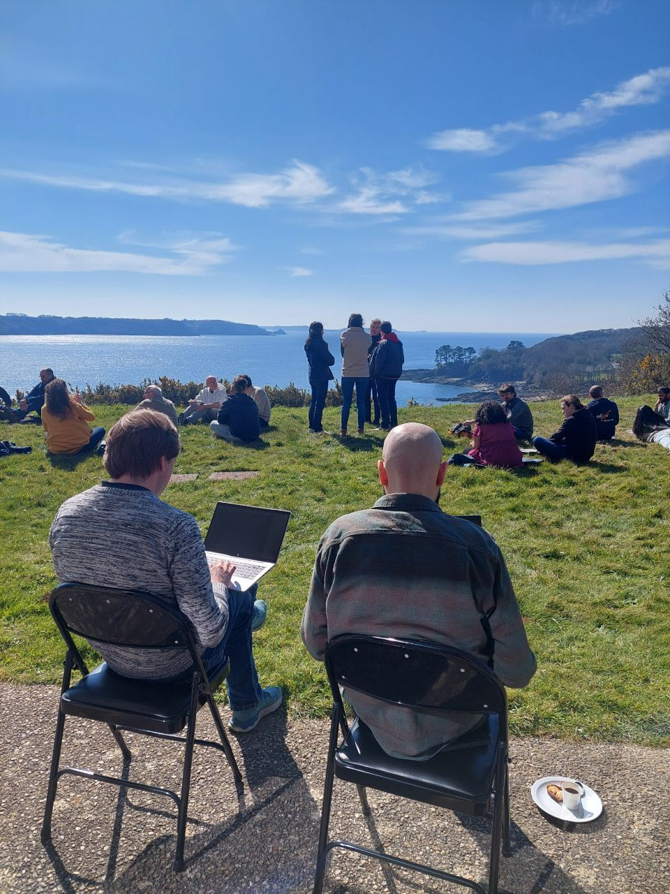

# Galaxy Hackathon in Brest, France: Innovation on the Edge of the Ocean

## March 18th–20th, 2025 | Brest, France 🌊

From **March 18th to 20th**, developers, researchers, and ocean data experts gathered in **Brest, France**, for a vibrant and hands-on **Hackathon** as part of **FAIR-EASE**. Set against the scenic backdrop of the Atlantic coast, the event brought together a dedicated group of innovators to build workflows, deploy tools, and push the boundaries of interoperability and FAIR data practices.

📷 © FAIR-EASE Hackathon 2025

## Galaxy Challenge: From SAMBA to SAGA

A major highlight of the event was the **Galaxy Challenge**—focused on adapting the **[SAMBA workflow](https://gitlab.ifremer.fr/bioinfo/workflows/samba)**, developed by **Ifremer**, into a fully operational Galaxy-compatible pipeline called **SAGA**.

- 🌟 **Marie** kickstarted the effort with a “crazy prototype” Galaxy workflow ([check it out](https://usegalaxy.eu/u/marie.josse/w/unnamed-workflow)) and opened a [PR to tools-iuc](https://github.com/ifremer-bioinformatics/tools-iuc/pull/1) to integrate key tools.
- 🧪 **Rand** wrapped the missing `dbotu3` tool and began developing a microDecon wrapper to handle contamination in metabarcoding data.  
  - [dbotu3 Tool Link](https://usegalaxy.eu/root?tool_id=toolshed.g2.bx.psu.edu/repos/bgruening/qiime2_dbotu_q2/qiime2_dbotu_q2/2022.11.1+galaxy0)
- 🔧 **Diana** rebuilt and polished the workflow from scratch, using SAMBA’s logic and Marie’s base to create the **SAGA workflow**.  
  - [Galaxy History](https://usegalaxy.eu/u/dianitachj24/h/wf-saga)  
  - [Final Workflow](https://usegalaxy.eu/u/dianitachj24/w/workflow-constructed-from-history-wf-saga)

## OGC API Meets Galaxy

The hackathon also tackled interoperability head-on with experiments in **OGC API - Processes** using the [fair-ease-galaxy-ogcapi](https://github.com/dmeaux/fair-ease-galaxy-ogcapi) project. The team successfully queried Galaxy’s API to produce compliant process records via FastAPI Swagger—a promising step toward broader data service integration.

## Hackathon Highlights: Tools, Metadata & Scheduling

The energy in the room led to fast-paced development and great progress thanks to **Sanjay**, **Paul**, and **Björn**:

- ✅ **TerriaMap Interactive Tool** added to Galaxy  
  - [Tool link](https://usegalaxy.eu/root?tool_id=interactive_tool_terriamap)  
  - [Repo](https://github.com/usegalaxy-eu/galaxy/tree/release_24.2_europe/tools/interactive/terriamap)

- ✅ **RO-Crate validation** support added in Galaxy testing
- ✅ Deployment of **two new ocean biogeochemistry tools**, with one updated
- ✅ **Pulsar integration** completed on UCA testbed  
  - [Integration PR](https://github.com/usegalaxy-eu/infrastructure-playbook/pull/1447)

- ✅ Ongoing work on **OGC API process generation** using a generic JSON builder
- ✅ Strategic advancement of **TPV meta-scheduling** including:  
  - Updated consumer scripts and broker functionality  
  - Metrics collection via **Telegraf + InfluxDB**  
  - Deployment coordination with **[EuroScienceGateway (ESG)](https://galaxyproject.org/projects/esg/) WP3 [Pulsar](https://galaxyproject.org/cloudman/services/pulsar/) admins**  
  - Migration of the **TPV Broker and consumer** to the EU infrastructure  
  - Long-term planning for stable EU deployment

## Looking Ahead

As waves crashed outside, ideas flowed inside. The **Hackathon in Brest** laid the groundwork for exciting future developments. Next steps include:

- Advancing **OGC API integration** into Galaxy workflows  
- Enriching RO-Crate metadata with spatial and temporal context  
- Exploring the **Hunga Tonga Challenge** for Galaxy-based contributions

## Useful Links & Repositories

- **SAGA Workflow in Galaxy**  
  - [History](https://usegalaxy.eu/u/dianitachj24/h/wf-saga)  
  - [Workflow](https://usegalaxy.eu/u/dianitachj24/w/workflow-constructed-from-history-wf-saga)

- **RO-Crate Metadata Work**  
  - [Testing PR](https://github.com/galaxyproject/galaxy/pull/19846)  
  - [Enhanced Metadata Branch](https://github.com/ResearchObject/galaxy/tree/more-rocrate-metadata)

- **TPV Broker & Pulsar Infrastructure**  
  - [TPV Broker Repo](https://github.com/usegalaxy-eu/tpv-broker)  
  - [Broker Playbook](https://github.com/usegalaxy-eu/ansible-tpv-broker)  
  - [Pulsar Util](https://github.com/usegalaxy-eu/ansible-pulsar-util)  
  - [EU Infra PRs](https://github.com/usegalaxy-eu/infrastructure-playbook/pull/1446)  
  - [UCA Pulsar PR](https://github.com/usegalaxy-eu/infrastructure-playbook/pull/1447)

## Final Thoughts 💬

The **FAIR-EASE Hackathon in Brest** was more than just a technical sprint—it was a celebration of community-driven innovation. It showcased the power of collaborative software development in tackling real-world challenges in data analysis, interoperability, and FAIR principles.

We’re proud of what we built, and even more excited about what comes next. 🚀  
Stay connected—this is just the beginning.

