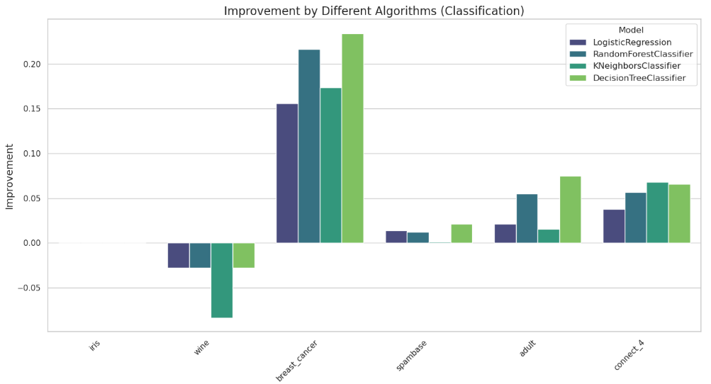

### Quality control ML datasets

Machine learning (ML) models are only as good as the data they learn from — and mislabeled data can severely impact model performance. That’s where Cleanlab comes in. We’re excited to announce the integration of [Cleanlab](https://github.com/cleanlab/cleanlab), a powerful open-source library for detecting label errors in datasets, into Galaxy by Mohammad Joudy! This integration allows users to run [Cleanlab-based detection tool](https://usegalaxy.eu/?tool_id=toolshed.g2.bx.psu.edu%2Frepos%2Fbgruening%2Fcleanlab%2Fcleanlab_issue_handler%2F2.7.1%2Bgalaxy1.0&version=latest) directly within the Galaxy platform.

### What Can You Do With It?

- Automatically identify mislabeled data using Cleanlab functionality.

- Improve ML model accuracy by filtering or correcting noisy labels for both tasks - classification and regression

### How It Works

1. Upload your dataset (with features and labels).

2. Run Cleanlab Galaxy tool to:

  - Get a report to identify potential label errors 

  - Clean your original raw dataset by removing the errorneous/low-quality samples to get better quality dataset

The tool makes it easy to clean up datasets in a reproducible way before training your models — a crucial step in any robust ML pipeline.

For more examples and details, see the [Cleanlab Galaxy tool](https://usegalaxy.eu/?tool_id=toolshed.g2.bx.psu.edu%2Frepos%2Fbgruening%2Fcleanlab%2Fcleanlab_issue_handler%2F2.7.1%2Bgalaxy1.0&version=latest).